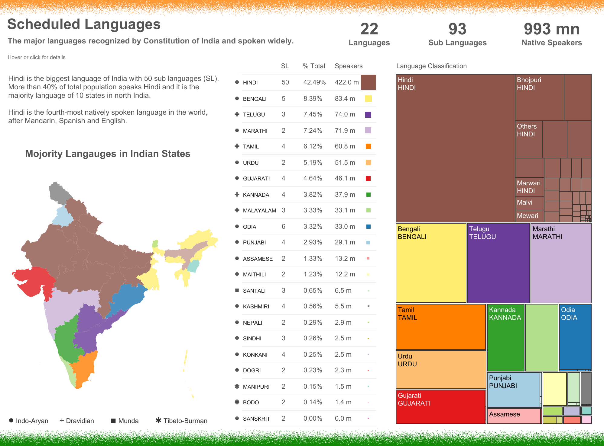
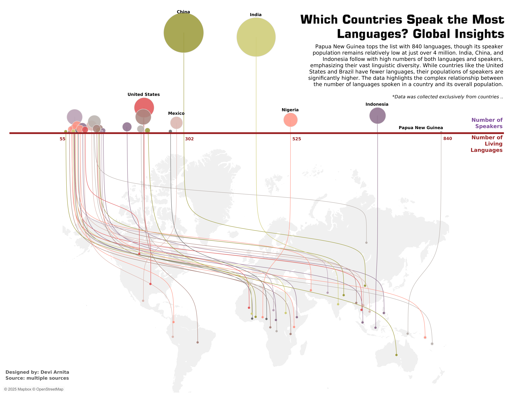
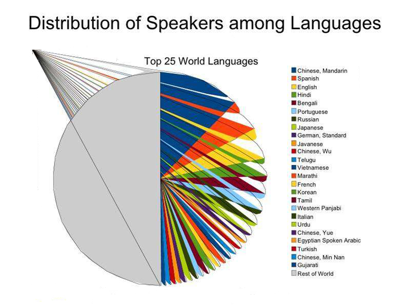

# Data Visualization

## Assignment 2: Good and Bad Data Visualization

### Requirements:

- Data visualizations are important tools for communication and convincing; we need to be able to evaluate the ways that data are presented in visual form to be critical consumers of information 
- To test your evaluation skills, locate two public data visualizations online, one good and one bad  
    - You can find data visualizations at https://public.tableau.com/app/discover or https://datavizproject.com/, or anywhere else you like! 
- For each visualization (good and bad):  
    - Explain (with reference to material covered up to date, along with readings and other scholarly sources, as needed) why you classified that visualization the way you did.

        ```
        First, we begin with a visualization that, in my opinion, is quite good (shown below)
        ```

        
        (source: https://public.tableau.com/app/profile/shivarajc/viz/LinguisticdiversityinIndia/Home)

        ```
        There are really three visualizations being depicted here, so for the sake of clarity and brevity I shall focus on the map of India. What this visualization is depicting is the linguistic diversity of India. It shows clearly where each language is spoke using the map and an effective choice of colour. It also demonstrates the relative size of each linguistic community using area. On the website there is also a further layer of interactivity where hovering your mouse over a region will display the majority language spoken in that region.

        I think this is a good visualization for a few reason.

        1. As is noted on page 22 of 04_choosing_the_right_visualization, colour is one of the most effective channels for communicating identity. We see the author thus making effective use of this channel by representing language families by colours (e.g. brown for HINDI or yellow for BENGALI). This clearly demonstrates the linguistic similarity (and difference) over the regions of India while also effectively linking the geographic locations with the respective size of each linguistic community in the treemap to the right.

        2. Another important channel which is highly effective at communicating identity is spatial region (see again p 22, 04_choosing_the_right_visualization slides). The author effectively uses space to separate the geographic location of each language (the map on the left) from the size of each community (the treemap to the right). 

        3. Finally, the author effectively makes use of separable channels in their visualization. In particular, the contrasting use of colour on the map makes use of the high separability of colour and spatial region (pg 26, 04_choosing_the_right_visualization slides) and the treemap on the right contrasts colour and area.
        

        For contrast, the visualization given below is not quite as effective.

        ```
        
        (source: https://public.tableau.com/app/profile/devi.arnita/viz/WorldwideLanguageDevitwbxPublicversion2/WorldwideLanguageDeviArnita2)

        ```
            1. Overly complex visualizations introduce cognitive load (pg. 64, 04_choosing_the_right_visualization slides) which reduces the reader's ability to obtain useful information from a glance. In this case, we see that the enormous number of lines connecting each country to its respective bubble on the upper part of the screen is quite hard to parse and thus only introduces confusion.

            2. The use of colour is inconsistent. As is noted in (pg 22, 04_choosing_the_right_visualization) colour is a powerful way to indicate identity and yet we see circles very far away from each other being represented by the same colours. This introduces confusion as to whether these two linguistic communities are related or not.

            3. Representing the number of people in each country as a circular area is good in the sense that area is an effective means of representing size, but it also does not work in this instance because many of the circles overlap. Overlapping areas also lead to an inability for a reader to quickly glance information due to complexity.


        ```
    - How could this data visualization have been improved?  
      ```
      Consider again the following visualization.
      ```
      

      ```
        1. Introduce a logarithmic scale for the Number of Living Languages axis. This would allow for a more even spread of the countries with low linguistic diversity, providing more visual clarity.

        2. Replacing the line segements between the circles representing each country to its place on the map with colour coding. Lumping together the World's languages into coarser categories (e.g. geographic location or major language family) and associating distinctive colours to each category would allow the bubbles up top to be effectively linked with a geographic location, thus reducing overall visual clutter.

      


      Separate from all this, I thought I would also spotlight this extraordinarily horrible attempt to visualize global linguistic diversity.
      ```
      
      (source: https://terralingua.org/2024/11/27/what-is-linguistic-diversity-and-how-is-it-linked-to-nature-and-culture/)
- Word count should not exceed (as a maximum) 500 words for each visualization (i.e. 
300 words for your good example and 500 for your bad example)

### Why am I doing this assignment?:

- This assignment ensures active participation in the course, and assesses the learning outcomes
* Apply general design principles to create accessible and equitable data visualizations
* Use data visualization to tell a story

### Rubric:

| Component               | Scoring   | Requirement                                                 |
|-------------------------|-----------|-------------------------------------------------------------|
| Data viz classification and justification | Complete/Incomplete | - Data viz are clearly classified as good or bad<br />- At least three reasons for each classification are provided<br />- Reasoning is supported by course content or scholarly sources |
| Suggested improvements  | Complete/Incomplete | - At least two suggestions for improvement<br />- Suggestions are supported by course content or scholarly sources |

## Submission Information

🚨 **Please review our [Assignment Submission Guide](https://github.com/UofT-DSI/onboarding/blob/main/onboarding_documents/submissions.md)** 🚨 for detailed instructions on how to format, branch, and submit your work. Following these guidelines is crucial for your submissions to be evaluated correctly.

### Submission Parameters:
* Submission Due Date: `23:59 - 30/04/2025`
* The branch name for your repo should be: `assignment-2`
* What to submit for this assignment:
    * This markdown file (assignment_2.md) should be populated and should be the only change in your pull request.
* What the pull request link should look like for this assignment: `https://github.com/<your_github_username>/visualization/pull/<pr_id>`
    * Open a private window in your browser. Copy and paste the link to your pull request into the address bar. Make sure you can see your pull request properly. This helps the technical facilitator and learning support staff review your submission easily.

Checklist:
- [ ] Create a branch called `assignment-2`.
- [ ] Ensure that the repository is public.
- [ ] Review [the PR description guidelines](https://github.com/UofT-DSI/onboarding/blob/main/onboarding_documents/submissions.md#guidelines-for-pull-request-descriptions) and adhere to them.
- [ ] Verify that the link is accessible in a private browser window.

If you encounter any difficulties or have questions, please don't hesitate to reach out to our team via our Slack. Our Technical Facilitators and Learning Support staff are here to help you navigate any challenges.
