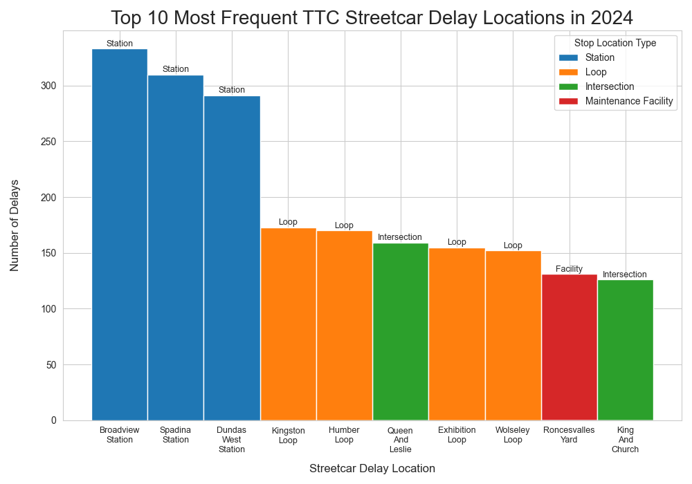
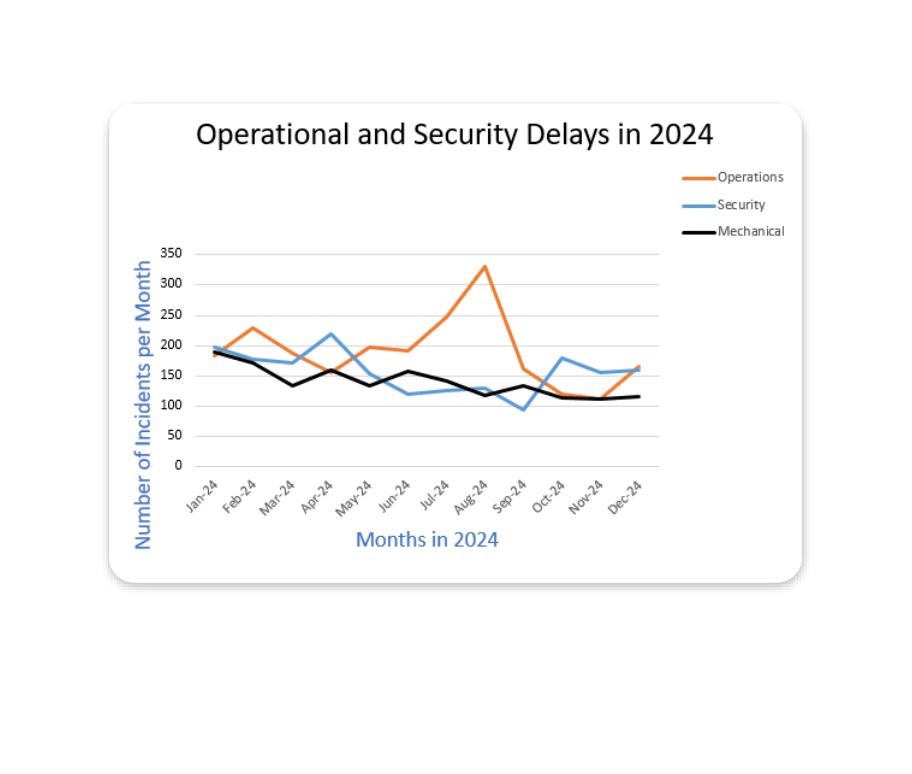
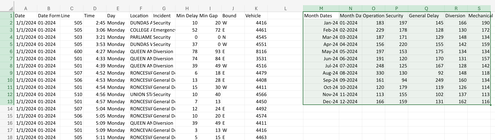

# Data Visualization

## Assignment 3: Final Project

### Requirements:
- We will finish this class by giving you the chance to use what you have learned in a practical context, by creating data visualizations from raw data. 
- Choose a dataset of interest from the [City of Toronto’s Open Data Portal](https://www.toronto.ca/city-government/data-research-maps/open-data/) or [Ontario’s Open Data Catalogue](https://data.ontario.ca/). 
- Using Python and one other data visualization software (Excel or free alternative, Tableau Public, any other tool you prefer), create two distinct visualizations from your dataset of choice.  
- For each visualization, describe and justify: 
    > What software did you use to create your data visualization?

    > Who is your intended audience? 
    
    > What information or message are you trying to convey with your visualization? 
    
    > What aspects of design did you consider when making your visualization? How did you apply them? With what elements of your plots? 
    
    > How did you ensure that your data visualizations are reproducible? If the tool you used to make your data visualization is not reproducible, how will this impact your data visualization? 
    
    > How did you ensure that your data visualization is accessible?  
    
    > Who are the individuals and communities who might be impacted by your visualization?  
    
    > How did you choose which features of your chosen dataset to include or exclude from your visualization? 
    
    > What ‘underwater labour’ contributed to your final data visualization product?

- This assignment is intentionally open-ended - you are free to create static or dynamic data visualizations, maps, or whatever form of data visualization you think best communicates your information to your audience of choice! 
- Total word count should not exceed **(as a maximum) 1000 words** 

# Data Source

For this project, I decided to use the database [02_activities/assignments/ttc-streetcar-delay-data-2024.csv](ttc-streetcar-delay-data-2024.csv) from the City of Toronto's Open Data website. This database contains information about all recorded delays of TTC Streetcars and includes information involving the date, the time, the incident type, etc. 

# Visualization #1: Delay Locations

The following is my first visualization made using seaborn using this python file [02_activities/assignments/ttc-delay.py](ttc-delay.py)

This is a bar graph which depicts the top 10 most frequent locations where streetcar delays occured where I coloured each bar according to the "type" of location where the stop occured. Namely, either a station, a loop (where streetcars turn around), an intersection, or a maintenance facility. My intended audience is a regular TTC streetcar rider who, like me, experiences delays and is curious about their cause. Although not what I expected, I find this graph conveys a message that delays seem to be unusually concentrated at stations and loops.

While designing this graph, I decided to make a few decisions to make the content more understandable and readable. Namely, although there is a large variety of delay locations, I decided to limit the scope to just the top 10 delay locations. I thought a bar chart could most effectively express the magnitude of the number of delays since it uses length as the primary means of expression, which is generally quite easy for humans to understand. I also decided to order the bars by magnitude and colour them by stop type in order to make it reduce the cognitive load necessary to understand the relationship between the bars. Finally, I made the names of the bars on the horizontal axis as vertical strings to fit the names in fully. 

This is fully reproducible as I have included the .csv file and used the relative path in the .py file. I also did all my data processing in the python file, so a user only has to hit run provided they have the necessary packages. I explicitly converted the database to .csv from .xslx so that the user does not need to have excel to access it.

I tried my best to make this an accessible graph by using colour to better emphasize the stop locations and using labels on top of each of the bars to skirt around colour-blindness issues (thank you ChatGPT). I think also ordering the bars by size better emphasizes the relationships.

Overall, the community who would be most impacted by this image would be frequent TTC streetcar riders. Delays at intersections are notable and frustrating events for a streetcar rider and this graphic helps clarify that the delays mostly are happening at stations. Now why that might be the case would require further exploration.

A surprising amount of work went into this image. First, the TTC staff had to carefully log each delay together with a large variety of accompanying information. Second, the City of Toronto's data collection team then had to compile this into a database and display it on the website. Next, I had to do quite a bit of preprocessing the data to make it actually usable for making a graph. Finally, it was also quite the connundrum to add those damned labels to the top of the bars. I initially wanted to use patterns, but seaborn does not seem to work so nicely with those.

# Visualization #2: Cause of Delay

Below, you will find my second visualization made from the same data source.

It is a line graph which plots the top three causes of delay--operations, security, and mechanical issues--versus time measured in months. My intended audience for this visualization are people who are skeptical about using TTC due to a fear for their safety. In particular, I think it pretty well communicates that operational issues (issues with the operator/driver) are the main cause of TTC delays. This is informative as serious security incidents would cause delays and we see that these are relatively small compared to the operational delays. We also see that there is a surprising number of operator delays in August for some reason! Not too sure why, perhaps the nice weather is too distracting.

In designing this visualization, I thought about how to most clearly display relationships between causes of delay. Namely, I reduced the scope to only 3 causes (there are many more). I also used various counting functions on Excel (and learned along the way that Excel sucks) to count each delay cause each month. Going day-to-day was too messy and hard to interpret. I also thought that a line graph would best show progression for each delay type category.

Unfortunately, this is not the most reproducible visualization. I included a .csv file [02_activities/assignments/ttc-streetcar-delay-data-2024MODIFIED.csv](ttc-streetcar-delay-data-2024MODIFIED.csv) of the modified excel spreadsheet so that someone can potentially open it in excel to get the visualization. Here is a screenshot of what you may find inside

 

 The fact that hinders reproducibility is that someone may not have access to excel and so cannot get the graph back. I think looking at the quality of the visualization, you may agree that this isn't a big loss as using python is arguably vastly superior for control and for the visual appeal. The impact of the lack of reproducibility is that it will be hard for an interested party to check my work or explore my pre-processing in more detail.

 Using the limited capacity of excel, I tried to make this visualization accessible by using colour to emphasize the difference between the lines. I also specifically used orange, blue, and black as I read online that these three contrast well for colour blind users. 

 The underwater labour was the same for the TTC Delay Location visualization as far as data collection goes. As for my own work, doing heroic battle with excel and it's propensity to "auto-correct" things that ought not to be corrected was a major unseen labour. The actual visualization creation once the pre-processing was completed was quite easy as it only involved me clicking a button and making a few modifications.

### Why am I doing this assignment?:  
- This ongoing assignment ensures active participation in the course, and assesses the learning outcomes: 
* Create and customize data visualizations from start to finish in Python
* Apply general design principles to create accessible and equitable data visualizations
* Use data visualization to tell a story  
- This would be a great project to include in your GitHub Portfolio – put in the effort to make it something worthy of showing prospective employers!

### Rubric:

| Component         | Scoring  | Requirement                                                                 |
|-------------------|----------|-----------------------------------------------------------------------------|
| Data Visualizations | Complete/Incomplete | - Data visualizations are distinct from each other - Data visualizations are clearly identified - Different sources/rationales (text with two images of data, if visualizations are labeled) - High-quality visuals (high resolution and clear data) - Data visualizations follow best practices of accessibility |
| Written Explanations | Complete/Incomplete | - All questions from assignment description are answered for each visualization - Explanations are supported by course content or scholarly sources, where needed |
| Code              | Complete/Incomplete | - All code is included as an appendix with your final submissions - Code is clearly commented and reproducible |

## Submission Information

🚨 **Please review our [Assignment Submission Guide](https://github.com/UofT-DSI/onboarding/blob/main/onboarding_documents/submissions.md)** 🚨 for detailed instructions on how to format, branch, and submit your work. Following these guidelines is crucial for your submissions to be evaluated correctly.

### Submission Parameters:
* Submission Due Date: `23:59 - 09/05/2025`
* The branch name for your repo should be: `assignment-3`
* What to submit for this assignment:
    * A folder/directory containing:
        * This file (assignment_3.md)
        * Two data visualizations 
        * Two markdown files for each both visualizations with their written descriptions.
        * Link to your dataset of choice.
        * Complete and commented code as an appendix (for your visualization made with Python, and for the other, if relevant) 
* What the pull request link should look like for this assignment: `https://github.com/<your_github_username>/visualization/pull/<pr_id>`
    * Open a private window in your browser. Copy and paste the link to your pull request into the address bar. Make sure you can see your pull request properly. This helps the technical facilitator and learning support staff review your submission easily.

Checklist:
- [ ] Create a branch called `assignment-3`.
- [ ] Ensure that the repository is public.
- [ ] Review [the PR description guidelines](https://github.com/UofT-DSI/onboarding/blob/main/onboarding_documents/submissions.md#guidelines-for-pull-request-descriptions) and adhere to them.
- [ ] Verify that the link is accessible in a private browser window.

If you encounter any difficulties or have questions, please don't hesitate to reach out to our team via our Slack. Our Technical Facilitators and Learning Support staff are here to help you navigate any challenges.
